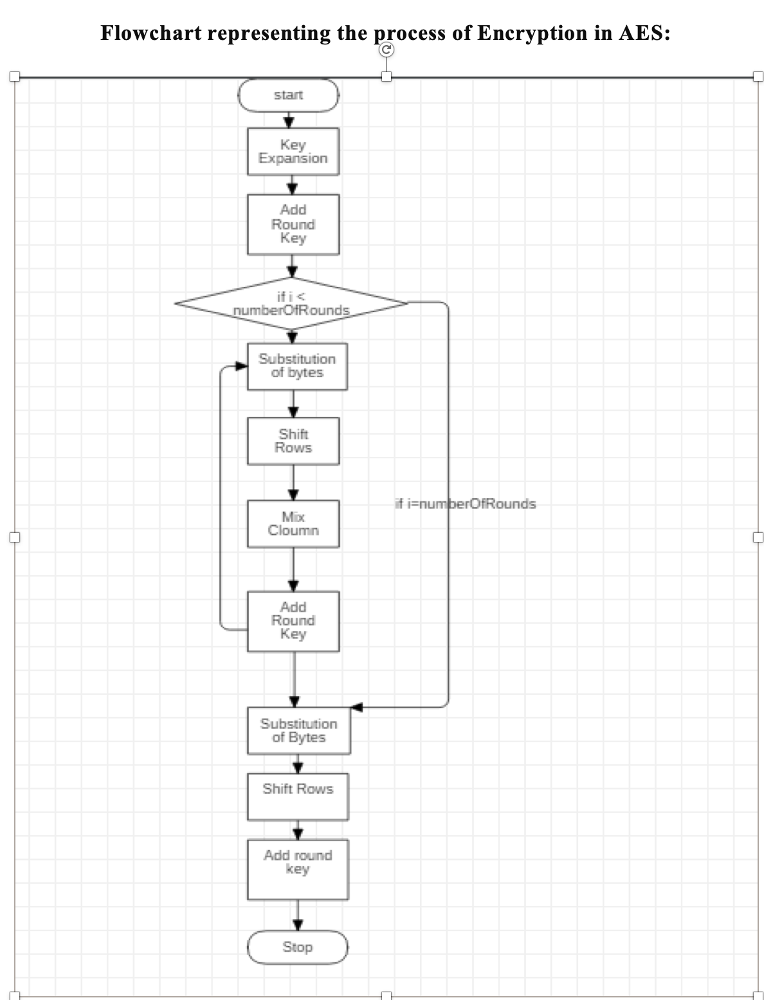

# AES ALGORITHM

The Advanced Encryption Standard (AES), also known by its original name Rijndael  is a specification for the encryption of electronic data established by the U.S. National Institute of Standards and Technology (NIST) in 2001. 

AES is a subset of the Rijndael block cipher developed by two Belgian cryptographers, Vincent Rijmen and Joan Daemen, who submitted a proposal to NIST during the AES selection process. Rijndael is a family of ciphers with different key and block sizes. 

This C program implements the AES algorithm and calculates the time taken for encryption and decryption.

 

# output

 

